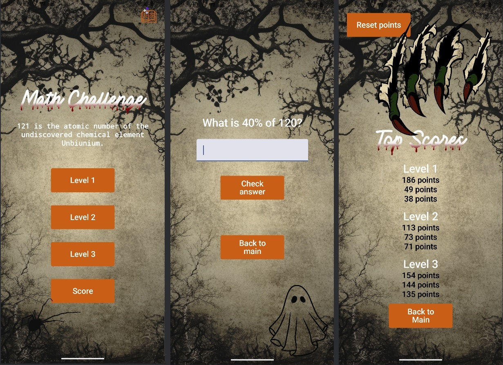

# MathApp

**MathApp** is an interactive Android application built with Jetpack Compose. It challenges users with math problems across different levels, making learning math fun and engaging. The app supports dynamic feedback based on the user’s performance and provides personalized messages after each session.

## Features

- **Multiple Levels**: Users can choose from different levels (1, 2, or 3), with problems getting progressively harder.
- **Score Feedback**: After completing 10 problems, users receive a feedback message that reflects their performance (e.g., ZOMBIE, WITCH, VAMPIRE, etc.).
- **Personalized End Messages**: Based on the final score, users are awarded a fun character title, such as Pumpkin Master or Ghost.
- **Room Database Integration**: Users' scores and levels are stored using Room for persistence.
- **Jetpack Compose UI**: The app is built using modern Jetpack Compose for smooth, declarative UI components.
- **Navigation**: Seamless navigation between screens using Android's Navigation Component.

## Screenshots

 
